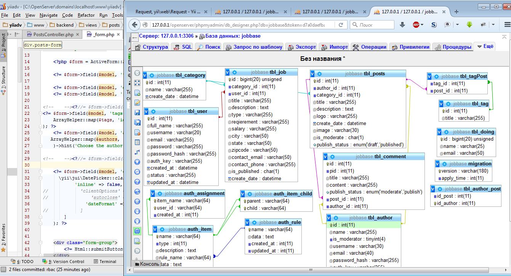
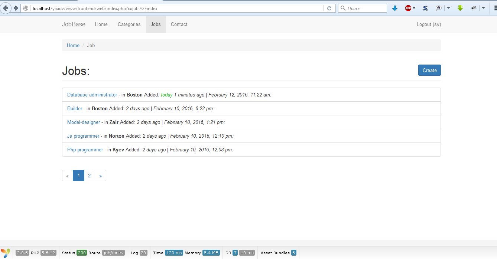
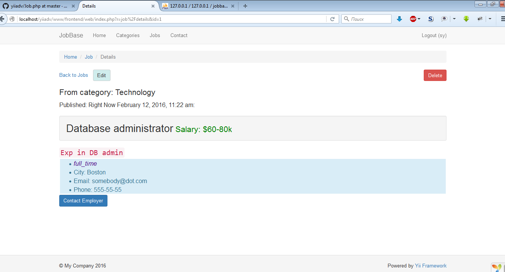
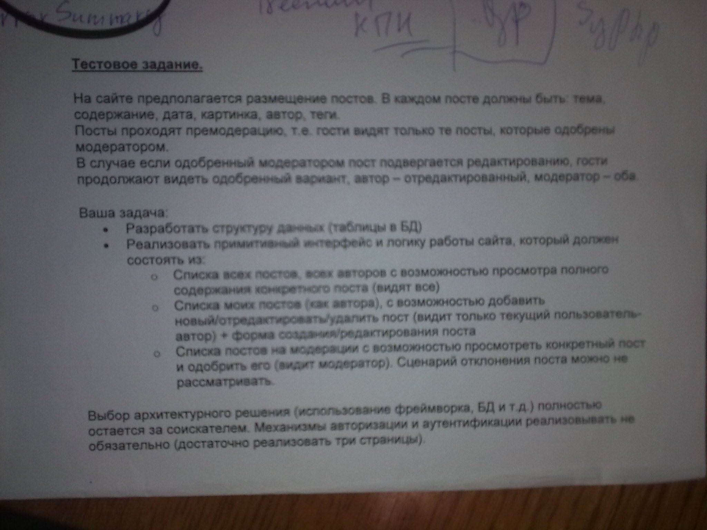

Yii 2 Advanced Project Template
===============================
```
Приложение состоит из сайта поиска работы с раздельными правами между пользователи, авторами вакансий и администраторами. Каждый автор может редактировать только свои вакансии. Реализован поиск по категориям. Для каждой вакансии отображается время с момента ее размещения в виде как на work.ua.
Второя часть приложения это тестовое задание расширеное пришедшим мне в голову функционалом.
```





DIRECTORY STRUCTURE
-------------------

```
common
    config/              contains shared configurations
    mail/                contains view files for e-mails
    models/              contains model classes used in both backend and frontend
console
    config/              contains console configurations
    controllers/         contains console controllers (commands)
    migrations/          contains database migrations
    models/              contains console-specific model classes
    runtime/             contains files generated during runtime
backend
    assets/              contains application assets such as JavaScript and CSS
    config/              contains backend configurations
    controllers/         contains Web controller classes
    models/              contains backend-specific model classes
    runtime/             contains files generated during runtime
    views/               contains view files for the Web application
    web/                 contains the entry script and Web resources
frontend
    assets/              contains application assets such as JavaScript and CSS
    config/              contains frontend configurations
    controllers/         contains Web controller classes
    models/              contains frontend-specific model classes
    runtime/             contains files generated during runtime
    views/               contains view files for the Web application
    web/                 contains the entry script and Web resources
    widgets/             contains frontend widgets
vendor/                  contains dependent 3rd-party packages
environments/            contains environment-based overrides
tests                    contains various tests for the advanced application
    codeception/         contains tests developed with Codeception PHP Testing Framework
```
